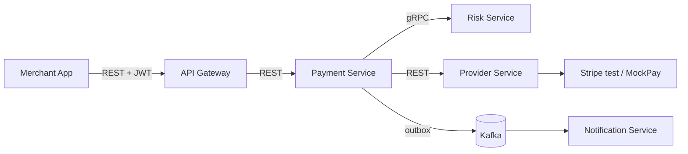

# SentinelPay

**Adaptive Payment Intelligence Platform** — an intelligence and decision layer between merchants and payment providers. Rather than forwarding a charge to a single provider, SentinelPay evaluates every payment and chooses the safest, most reliable way to execute it.

> **v1 scope (this build):** resilient **multi-provider routing and failover** — risk-evaluate → decide → route to a healthy provider → automatically fail over on failure, with **guaranteed no double-charge** and a fully **explainable decision trail**. The broader platform vision is the north star, sequenced after v1. See [docs/product/vision/](docs/product/vision/) and [docs/product/PRD.md](docs/product/PRD.md).

## Table of contents

- [Documentation](#documentation)
- [Architecture](#architecture)
- [Modules](#modules)
- [Tech stack](#tech-stack)
- [Prerequisites](#prerequisites)
- [Build and test](#build-and-test)
- [Local development](#local-development)
- [Status](#status)
- [Contributing and license](#contributing-and-license)

## Documentation

Start at [docs/README.md](docs/README.md). The approved chain:

| Document | Purpose |
| --- | --- |
| [PRD](docs/product/PRD.md) | Approved v1 scope, non-goals, success metrics |
| [System Design](docs/architecture/system-design.md) | Bounded contexts, topology, failure modes, ADRs |
| [Data Architecture](docs/architecture/data-architecture.md) | Ownership, consistency, indexing, retention |
| [Backend Architecture](docs/architecture/backend-architecture.md) | Service contracts, domain model, flows |
| [OpenAPI](docs/architecture/contracts/openapi.yaml) | Public and ops REST contract (OpenAPI 3.1, lint-clean) |
| [ADRs](docs/architecture/adrs/) | Architecture decision records 0001–0011 |

## Architecture

Five services with a **synchronous** critical path (gRPC + REST) and **asynchronous** Kafka fan-out, database-per-service (PostgreSQL), and Redis for ephemeral counters. Rationale in the [ADRs](docs/architecture/adrs/).



| Path | Protocol | Purpose |
| --- | --- | --- |
| Merchant → Gateway → Payment | REST | Charge lifecycle, idempotency, failover |
| Payment → Risk | gRPC | Pluggable risk scoring on the critical path |
| Payment → Provider | REST | Authorize/capture via Stripe or MockPay |
| Payment/Risk → Kafka → Notification | Events | Non-critical fan-out (email, audit) |

## Modules

Maven multi-module layout (`sentinelpay-parent`):

| Module | Role |
| --- | --- |
| `sentinelpay-common` | Shared web baseline (error envelope, correlation propagation) |
| `sentinelpay-proto` | gRPC/protobuf contract (risk scoring) |
| `api-gateway` | Edge: JWT auth, routing, rate limiting |
| `payment-service` | Lifecycle, decisioning, routing, failover, idempotency (system of record) |
| `risk-service` | Pluggable risk-evaluation pipeline (gRPC) |
| `provider-service` | Provider abstraction (Stripe + MockPay) and health |
| `notification-service` | Event-driven notifications |

## Tech stack

| Layer | Technologies |
| --- | --- |
| Runtime | Java 17, Spring Boot 3.2, Spring Cloud Gateway |
| Data | PostgreSQL 15, Redis 7, Flyway |
| Messaging | Apache Kafka, transactional outbox |
| RPC | gRPC / Protocol Buffers |
| Observability | Micrometer, OpenTelemetry |
| Testing | Testcontainers, JUnit 5 |
| Build | Maven (multi-module), Maven Wrapper |

## Prerequisites

- **JDK 17**
- **Maven 3.9+** (or use the included `./mvnw` wrapper)
- **Docker** — required for Testcontainers during tests and for local infrastructure via Compose

## Build and test

```bash
./mvnw -q -DskipTests verify   # compile and package all modules
./mvnw -q verify               # full build + tests (Docker must be running)
```

The [Makefile](Makefile) provides shortcuts:

| Target | Description |
| --- | --- |
| `make build` | Compile all modules (skip tests) |
| `make test` | Run all tests |
| `make verify` | Full build and tests |
| `make up` / `make down` | Start or stop local infrastructure |
| `make run-gateway` | Run API Gateway |
| `make run-payment` | Run Payment Service |
| `make run-risk` | Run Risk Service |
| `make run-provider` | Run Provider Service |
| `make run-notification` | Run Notification Service |

## Local development

Start shared infrastructure (Postgres, Redis, Kafka, MailHog):

```bash
docker compose up -d
# or: make up
```

| Service | Host port | Notes |
| --- | --- | --- |
| Postgres (payments) | 5434 | DB `sentinelpay_payments` |
| Postgres (risk) | 5435 | DB `sentinelpay_risk` |
| Postgres (provider) | 5436 | DB `sentinelpay_provider` |
| Postgres (notifications) | 5437 | DB `sentinelpay_notifications` |
| Redis | 6379 | Velocity counters, rate limits |
| Kafka | 9092 | Event bus |
| MailHog SMTP / UI | 1025 / 8025 | Local email capture |

Service shells use Testcontainers for integration tests; Compose provides the shared dependencies for runtime wiring as features land.

## Status

| Area | State |
| --- | --- |
| Architecture | Complete and approved (PRD → system-design → data-architecture → backend-architecture) |
| Shared libraries | `sentinelpay-common` and `sentinelpay-proto` build green |
| Services | Scaffolding in progress across all five deployables |
| Domain logic | Charge/failover, Kafka outbox, Redis, and gRPC runtime wiring delivered incrementally |

## Contributing and license

See [CONTRIBUTING.md](CONTRIBUTING.md). Licensed under [MIT](LICENSE).
