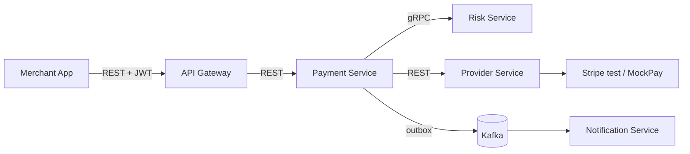
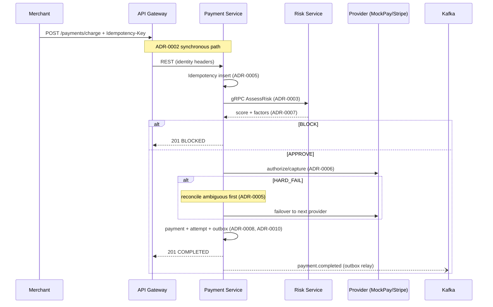

<div align="center">

# SentinelPay

**Adaptive Payment Intelligence Platform**

Intelligent routing · Risk-aware decisions · Zero double-charge guarantee

[](https://github.com/amritmalla/SentinelPay/stargazers)
[](https://github.com/amritmalla/SentinelPay/forks)
[](https://github.com/amritmalla/SentinelPay/issues)
[](LICENSE)

</div>

**SentinelPay** is an intelligent payment orchestration layer between merchants and multiple payment providers. Instead of blindly forwarding charges, it evaluates risk, selects the best healthy provider, and fails over on failure — with a strict no-double-charge guarantee and an explainable decision trail.

> **v1 scope (this build):** resilient **multi-provider routing and failover** — risk-evaluate → decide → route → fail over, with **guaranteed no double-charge** and a fully **explainable decision trail**. Broader platform vision is sequenced after v1. See [docs/product/vision/](docs/product/vision/) and [docs/product/PRD.md](docs/product/PRD.md).

## Table of contents

- [Documentation](#documentation)
- [Features](#features)
- [Architecture](#architecture)
- [Modules](#modules)
- [Tech stack](#tech-stack)
- [Prerequisites](#prerequisites)
- [Build and test](#build-and-test)
- [Run locally](#run-locally)
- [Demo](#demo)
- [Using the API](#using-the-api)
- [Observability](#observability)
- [Status](#status)
- [Contributing and license](#contributing-and-license)

## Documentation

Start at [docs/README.md](docs/README.md). The approved chain:

| Document | Purpose |
| --- | --- |
| [PRD](docs/product/PRD.md) | Approved v1 scope, non-goals, success metrics |
| [System Design](docs/architecture/system-design.md) | Bounded contexts, topology, failure modes, ADRs |
| [Data Architecture](docs/architecture/data-architecture.md) | Ownership, consistency, indexing, retention |
| [Backend Architecture](docs/architecture/backend-architecture.md) | Service contracts, domain model, flows |
| [OpenAPI](docs/architecture/contracts/openapi.yaml) | Public and ops REST contract (OpenAPI 3.1, lint-clean) |
| [Observability](docs/architecture/observability.md) | Signals, metric catalog, SLOs, alerts, dashboards |
| [ADRs](docs/architecture/adrs/) | Architecture decision records 0001–0012 |

## Features

- **Multi-provider routing & failover** — a charge is attempted against a healthy provider and automatically fails over to the next on failure, within a single request (MockPay primary; a second Stripe slot, stubbed by default, swappable to real Stripe test-mode via `STRIPE_MODE`).
- **No double-charge (correctness gate)** — idempotency-key-first writes, ambiguous-timeout reconciliation *before* any failover, optimistic-concurrency state machine, and a crash-recovery reconciliation sweep. Enforced by an integration test asserting **double-charge = 0** across every failover path.
- **Explainable risk scoring** — pluggable rule-based scorer over gRPC returning `score ∈ [0,1]`, contributing factors, and `model_version`; Redis velocity counters; amount-based fallback on gRPC deadline (flagged in the trail).
- **Decision trail** — every charge composes its risk factors and provider attempts into an auditable, explainable record.
- **Refunds** — full/partial refunds against completed payments, emitted as events.
- **Stripe webhook reconciliation** — idempotent inbound webhook handling (signature verification deferred in v1).
- **Security boundary** — JWT (HS256) auth at the gateway with identity-header injection; merchant-scoped access and default-deny ops endpoints.
- **Observability** — RED + business metrics (recovered-authorization, a double-capture tripwire, per-provider latency), distributed traces across REST → gRPC → Kafka, SLOs with burn-rate alerts, and Grafana dashboards.

## Architecture

Five services with a **synchronous** critical path (gRPC + REST) and **asynchronous** Kafka fan-out, database-per-service (PostgreSQL), and Redis for ephemeral counters. Rationale in the [ADRs](docs/architecture/adrs/).



| Path | Protocol | Purpose |
| --- | --- | --- |
| Merchant → Gateway → Payment | REST | Charge lifecycle, idempotency, failover |
| Payment → Risk | gRPC | Pluggable risk scoring on the critical path |
| Payment → Provider | REST | Authorize/capture via Stripe or MockPay |
| Payment/Risk → Kafka → Notification | Events | Non-critical fan-out (email, audit) |

## Modules

Maven multi-module layout (`sentinelpay-parent`):

| Module | Role |
| --- | --- |
| `sentinelpay-common` | Shared web baseline (error envelope, correlation propagation) |
| `sentinelpay-proto` | gRPC/protobuf contract (risk scoring) |
| `api-gateway` | Edge: JWT auth, routing, rate limiting |
| `payment-service` | Lifecycle, decisioning, routing, failover, idempotency (system of record) |
| `risk-service` | Pluggable risk-evaluation pipeline (gRPC) |
| `provider-service` | Provider abstraction (Stripe + MockPay) and health |
| `notification-service` | Event-driven notifications |

## Tech stack

| Layer | Technologies |
| --- | --- |
| Language / runtime | Java 17, Spring Boot 3.2, Spring Cloud Gateway |
| Data | PostgreSQL 15, Redis 7, Flyway |
| Communication | REST, gRPC + Protocol Buffers |
| Messaging | Apache Kafka, transactional outbox |
| Observability | Micrometer, OpenTelemetry, Prometheus, Grafana, Tempo |
| Testing | Testcontainers, JUnit 5 |
| Build / infra | Maven (multi-module), Maven Wrapper, Docker Compose |

## Prerequisites

- **JDK 17**
- **Maven 3.9+** (or use the included `./mvnw` wrapper)
- **Docker** — required for Testcontainers during tests and for local infrastructure via Compose
- Optional for the API examples below: `curl`, `jq`

## Build and test

```bash
./mvnw -q -DskipTests verify   # compile and package all modules
./mvnw -q verify               # full build + tests (Docker must be running)
```

After pulling changes or editing `sentinelpay-common`, install shared modules before running a single service (otherwise Maven may use a stale local copy and startup fails on missing classes or logging):

```bash
./mvnw -q install -pl sentinelpay-common,sentinelpay-proto -DskipTests
```

Alternatively, add `-am` when starting a service so Maven rebuilds its module dependencies from the reactor:

```bash
./mvnw -q -pl payment-service -am spring-boot:run
```

## Run locally

### One command (recommended for reviewers)

```bash
git clone https://github.com/amritmalla/SentinelPay.git
cd SentinelPay
docker compose up --build
# or: make up
```

That starts infra, the observability stack, and all five services. Gateway: **[http://localhost:8080](http://localhost:8080)**. Grafana, Tempo, and MailHog come up with the stack. Compose uses the `dev,observability` profile on the gateway and payment service so `/dev/token` and the provider-control demo lever work — **demo posture only; never ship `dev` to production.**

```bash
bash scripts/demo.sh      # Git Bash / macOS / Linux
# or: pwsh scripts/demo.ps1
# or: make demo
```

### Develop a single service (IDE / Maven)

Start **infra only**, then run the service you are working on from the host:

```bash
make up-infra
# or: docker compose up -d postgres-payments postgres-risk postgres-provider postgres-notifications redis zookeeper kafka mailhog prometheus tempo grafana
```

When services run on the host, point Prometheus at them by swapping the scrape config to [prometheus-ide.yml](ops/observability/prometheus/prometheus-ide.yml) in `docker-compose.yml` (full-stack compose already uses in-network service names).

Run services with `-am` so shared modules rebuild from the reactor:

```bash
./mvnw -q -pl api-gateway     -am spring-boot:run -Dspring-boot.run.profiles=dev
./mvnw -q -pl payment-service -am spring-boot:run -Dspring-boot.run.profiles=dev
./mvnw -q -pl risk-service    -am spring-boot:run
./mvnw -q -pl provider-service -am spring-boot:run
./mvnw -q -pl notification-service -am spring-boot:run
```

Add `observability` to export traces to Tempo (see [Observability](#observability)). `make run-*` shortcuts wrap the above.

**Ports**

| Component | Host port | Notes |
| --- | --- | --- |
| API Gateway | 8080 | Public entry point (JWT); containerized in full-stack mode |
| Payment Service | 8082 | System of record |
| Risk Service | 8083 (REST), 9091 (gRPC) | Risk scoring |
| Notification Service | 8084 | Event consumer |
| Provider Service | 8085 | Provider health/abstraction |
| Postgres (payments / risk / provider / notifications) | 5434 / 5435 / 5436 / 5437 | DB-per-service |
| Redis | 6379 | Velocity counters, rate limits |
| Kafka | 9092 | Event bus (host); containers use `kafka:29092` internally |
| MailHog SMTP / UI | 1025 / 8025 | Local email capture |
| Prometheus | 9090 | Metrics + alert rules |
| Tempo | 4318 (OTLP), 3200 | Trace backend |
| Grafana | 3000 | Dashboards (anonymous viewer) |

## Demo

Three acts, driven by [scripts/demo.sh](scripts/demo.sh) against the full stack (Acts 4–5 require `dev` profile with bandit + breaker):

| Act | What happens | What to observe |
| --- | --- | --- |
| **1. Happy path** | Charge $25 → `COMPLETED` via MockPay | Decision trail; receipt in [MailHog](http://localhost:8025) |
| **2. Failover** | Program MockPay → `HARD_FAIL`, charge again | `COMPLETED` via Stripe stub; Grafana **Correctness** — `recovered_authorization_total` ↑, `double_capture_total` stays **0** |
| **3. Risk block** | Six $1,500 charges for the same email | Velocity + amount cross the 0.70 block threshold; trail shows `amount:` and `velocity_1h:` factors |
| **4. Breaker shift** | MockPay hard-fails until breaker opens | Trail: MockPay `breaker_state=OPEN`, Stripe first; Grafana **Provider Health** — breaker gauge flips |
| **5. Bandit recovery** | Reset MockPay healthy, wait cooldown, recharge | Trail: HALF_OPEN/CLOSED probe; bandit `(α, β)` in routing rationale; MockPay regains share |

Automated twin: `npx newman run postman/SentinelPay.postman_collection.json -e postman/SentinelPay.local.postman_environment.json`

### Charge sequence (synchronous critical path)



### How it works → why (ADR map)

| Headline | Mechanism | ADR |
| --- | --- | --- |
| No double-charge | Idempotency-key-first + ambiguous-timeout reconciliation before failover | [0005](docs/architecture/adrs/0005-exactly-once-capture-idempotency.md) |
| Reliable side effects | Transactional outbox → Kafka | [0008](docs/architecture/adrs/0008-transactional-outbox.md) |
| Safe concurrent updates | Optimistic-concurrency state machine on `payment` | [0010](docs/architecture/adrs/0010-payment-optimistic-concurrency.md) |
| Fast risk on the hot path | gRPC to Risk Service (100 ms deadline) | [0003](docs/architecture/adrs/0003-grpc-for-risk-on-critical-path.md) |
| Provider swap without rewrite | `PaymentProvider` abstraction; MockPay + Stripe slot | [0006](docs/architecture/adrs/0006-provider-abstraction-mockpay.md) |
| Explainable trail | API composition across Payment + Risk (no cross-DB join) | [0004](docs/architecture/adrs/0004-fold-decisioning-into-payment.md) |
| Smart routing | Four-stage pipeline; Redis health + bandit posteriors; trail rationale | [0013](docs/architecture/adrs/0013-smart-routing-model-and-health-state.md) |
| Circuit breaking | Resilience4j per provider; never-strand guardrail | [0014](docs/architecture/adrs/0014-circuit-breaking-resilience4j.md) |
| Adaptive routing | Thompson sampling bandit; seeded replay | [0015](docs/architecture/adrs/0015-adaptive-routing-bandit.md) |
| Reconcile safety | Conservative reconcile; idempotent Stripe replay | [0016](docs/architecture/adrs/0016-conservative-reconcile-semantics.md) |


## Using the API

All calls go through the gateway at `http://localhost:8080`. Merchant endpoints require a `MERCHANT` token; ops endpoints require an `OPS` token; webhooks are unauthenticated.

**1. Mint a token** (gateway running with the `dev` profile):

```bash
MERCHANT_ID=$(uuidgen)   # any UUID
TOKEN=$(curl -s localhost:8080/dev/token \
  -H 'Content-Type: application/json' \
  -d "{\"role\":\"MERCHANT\",\"merchant_id\":\"$MERCHANT_ID\"}" | jq -r .token)
```

**2. Charge a payment** (the `Idempotency-Key` header makes retries safe):

```bash
curl -s localhost:8080/api/v1/payments/charge \
  -H "Authorization: Bearer $TOKEN" \
  -H 'Content-Type: application/json' \
  -H 'Idempotency-Key: order-1001' \
  -d '{"amount_cents":2500,"currency":"USD","customer_email":"buyer@example.com","merchant_category":"retail","card_country":"US"}'
# → 201
# { "payment_id": "…", "status": "COMPLETED", "provider": "MOCKPAY", "trail_id": "…" }
```

Repeating the same `Idempotency-Key` returns the original result instead of charging again.

**Endpoints** (base `http://localhost:8080`, full contract in [openapi.yaml](docs/architecture/contracts/openapi.yaml)):

| Method | Path | Auth | Purpose |
| --- | --- | --- | --- |
| `POST` | `/dev/token` | none (dev) | Mint a local JWT (`role`, `merchant_id`) |
| `POST` | `/dev/providers/{provider}/program` | none (dev) | Program provider outcomes for demo failover (`{"outcomes":["HARD_FAIL"]}`) |
| `POST` | `/api/v1/payments/charge` | MERCHANT | Create/charge a payment (`Idempotency-Key` header) |
| `GET` | `/api/v1/payments` | MERCHANT | List payments (merchant-scoped, paginated) |
| `GET` | `/api/v1/payments/{id}` | MERCHANT | Retrieve a payment |
| `POST` | `/api/v1/payments/{id}/refunds` | MERCHANT | Refund a completed payment |
| `GET` | `/api/v1/payments/{id}/trail` | OPS | Decision trail (risk factors + attempts) |
| `GET` | `/api/v1/fraud-assessments/{txn_id}` | OPS | Risk assessment for a transaction |
| `POST` | `/api/v1/webhooks/stripe` | none | Inbound Stripe webhook |

The OpenAPI contract also reserves two ops endpoints — `GET /api/v1/providers/health` and `POST /api/v1/reconciliation-runs` — that are **contract-only in this build** (reconciliation currently runs as a scheduled sweep, not an on-demand endpoint; provider health is exposed via metrics, see [Observability](#observability)).

## Running against real Stripe (test mode)

Default demo and CI use `sentinelpay.providers.stripe.mode=stub` (hermetic). To exercise the real `StripeProvider` adapter against Stripe **test mode**:

1. Copy [`.env.example`](.env.example) → `.env` and set `STRIPE_API_KEY=sk_test_…` (never commit `.env`; rotate if exposed).
2. Quick API smoke: `./scripts/stripe-smoke.sh` (create → capture → refund via Stripe API).
3. Full stack with real adapter:
   ```bash
   docker compose -f docker-compose.yml -f docker-compose.stripe.yml up --build
   ```
4. Webhooks: `stripe listen --forward-to localhost:8080/api/v1/webhooks/stripe` — put the CLI signing secret in `STRIPE_WEBHOOK_SECRET`. Signature verification is already implemented in `WebhookService`.

Use **test-mode keys only** (`sk_test_…` / `pk_test_…`). Live keys are out of scope.

## Observability

**Metrics and logs** are always enabled — Prometheus scrapes each service's `/actuator/prometheus` as soon as it is up. **Distributed trace export** is opt-in: each service ships an `application-observability.yml` that configures OTLP export to Tempo only when the `observability` Spring profile is active. Default local runs and tests omit that profile, so no `OTLP_TRACES_ENDPOINT` (or Tempo) is required to start services.

| What | Default local run | With `observability` profile |
| --- | --- | --- |
| Metrics → Prometheus | yes | yes |
| JSON logs (stdout) | yes | yes |
| Traces → Tempo | no (in-process only) | yes |

With the stack from `docker compose up`, open **Grafana at [http://localhost:3000](http://localhost:3000)**. Four provisioned dashboards:

| Dashboard | Shows |
| --- | --- |
| Charge golden signals | Charge-path rate / errors / latency vs the SLO |
| Correctness | `double_capture_total` (must be **0**), recovered-authorization and risk-fallback rates |
| Provider health | Per-provider success ratio and latency |
| Pipeline health | Outbox depth, relay lag, Kafka consumer lag |

To see a live charge end to end **with traces in Tempo**, run every service with the `observability` profile and fire a charge:

```bash
./mvnw -q -pl api-gateway spring-boot:run -Dspring-boot.run.profiles=dev,observability
./mvnw -q -pl payment-service spring-boot:run -Dspring-boot.run.profiles=observability
./mvnw -q -pl risk-service spring-boot:run -Dspring-boot.run.profiles=observability
./mvnw -q -pl provider-service spring-boot:run -Dspring-boot.run.profiles=observability
./mvnw -q -pl notification-service spring-boot:run -Dspring-boot.run.profiles=observability
```

Or set `SPRING_PROFILES_ACTIVE` (e.g. `dev,observability` on the gateway). Override the Tempo URL with `OTLP_TRACES_ENDPOINT` if needed (profile default: `http://localhost:4318/v1/traces`).

- **Traces** — a charge produces one trace spanning Gateway → Payment → Risk (gRPC) → Provider, plus the Kafka consumer span; searchable in Tempo (Grafana → Explore) by the `sentinelpay.correlation_id` attribute.
- **Metrics** — scraped by Prometheus (`:9090`); alert rules (including a page on `double_capture_total > 0`) live in [ops/observability/prometheus/rules.yaml](ops/observability/prometheus/rules.yaml).

Full reference: [docs/architecture/observability.md](docs/architecture/observability.md).

## Status

| Area | State |
| --- | --- |
| Architecture | Complete and approved (PRD → system-design → data/backend architecture, ADRs 0001–0011) |
| Charge & failover | Delivered — routing, in-request failover, ambiguous-timeout reconciliation, no-double-charge gate |
| Risk pipeline | Delivered — gRPC scoring, Redis velocity, explainable trail, amount-based fallback |
| Payment surface | Delivered — charge, list/get, refunds, decision trail, Stripe webhook |
| Security | Delivered — gateway JWT auth, identity injection, merchant-scoping, default-deny ops |
| Quality gate | Delivered — CI (`./mvnw verify`), REST contract tests, coverage, OpenAPI lint |
| Observability | Delivered — RED + business metrics, distributed tracing, SLO burn-rate alerts, dashboards |
| Packaging | Delivered — one-command `docker compose up`, narrated demo, hardened images |

## Contributing and license

See [CONTRIBUTING.md](CONTRIBUTING.md). Licensed under [MIT](LICENSE).
