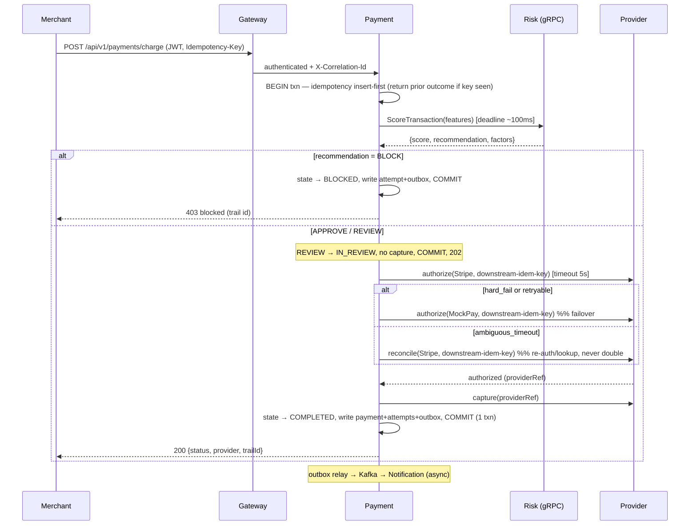

# Backend Architecture: SentinelPay (v1)

## Status

approved (2026-07-12).

## Source Inputs

- System design: [system-design.md](system-design.md) (approved v0.2.0)
- Data architecture: [data-architecture.md](data-architecture.md) (approved v0.1.0)
- ADRs: 0001 (microservices), 0002 (sync critical path), 0003 (gRPC for Risk), 0004 (decisioning folded into Payment), 0005 (exactly-once capture), 0006 (provider abstraction/MockPay), 0007 (pluggable risk scorer), 0008 (transactional outbox), 0009 (DB-per-service), 0010 (payment optimistic concurrency), 0011 (bounded event/outbox retention)
- PRD sections: [PRD.md](../product/PRD.md) — Scope (5 outcomes), Non-goals, Success Metrics (double-charge=0, ≥95% recovered auth, ≤150 ms overhead, 100% trail coverage)
- Implementation ecosystem: **Spring Boot 3.2 / Java 17** (fixed by the existing stack per PRD constraints)

This document covers the whole v1 backend (5 services) as one system, organized by bounded context. It preserves the approved system design; no boundaries, consistency models, or the sync-critical-path decision are changed here.

## Scope

### Owns

- **Edge & Access (API Gateway):** JWT validation, identity-header injection, correlation IDs, token-bucket rate limiting, routing to Payment.
- **Payment Execution + Decisioning/Routing (Payment Service):** the charge command; risk gate; provider selection + in-request failover; payment lifecycle/state machine; exactly-once capture; refunds; lifecycle events; the decision trail read surface.
- **Risk Intelligence (Risk Service):** the staged risk-evaluation pipeline behind a `RiskScorer` Strategy; explainable assessments; velocity; risk events.
- **Provider Integration (Provider Service):** the `PaymentProvider` abstraction (Stripe + MockPay); authorize/capture/refund; error normalization; provider health.
- **Notification Delivery (Notification Service):** event-driven email delivery, idempotent per `eventId`.

### Does Not Own

- Real-money settlement, PCI cardholder-data handling, or raw PAN (v1 uses provider test tokens).
- Multi-tenant org/user management, RBAC beyond merchant-scoping, billing (Merchant/Identity contexts — deferred).
- Cost-optimized/ML routing, adaptive/behavioral fraud signals, analytics read models (deferred).
- A standalone Decision Service or Audit Service (folded / deferred per ADR-0004).
- Persistence schema/DDL (owned by `implementations/data/postgres`), deployment topology (owned by infrastructure-platform).

### Open Decisions

- **Charge semantics:** v1 charge performs **authorize + immediate capture** in one synchronous call. *Recommended* for v1 simplicity; separate `authorize`/`capture` lifecycle deferred. Owner: self.
- **REVIEW handling:** a risk `REVIEW` recommendation **holds** the payment (`IN_REVIEW`, no capture) with **no manual-approve workflow** in v1. *Recommended*; manual review is a future Risk-Analyst capability. Owner: self.
- **Stripe webhook signature verification:** recommended even in v1, but PRD lists it as deferred. Marked as a security deferral below. Owner: self.

## Backend Boundary

| Area | Decision |
|---|---|
| Services | API Gateway, Payment, Risk, Provider, Notification |
| Primary consumers | Merchant application (public REST); Payment Ops Specialist (ops REST + trail) |
| Upstream dependencies | Merchant app; Stripe test mode; MockPay simulator; Stripe webhooks (inbound) |
| Downstream dependencies | Postgres×4, Redis, Kafka, MailHog |
| Runtime expectations | Charge path **p95 ≤ 150 ms added overhead** excluding provider time; ≥95% recoverable-failure recovery; single-region local (Docker Compose) |

## Domain Model

### Core Concepts

| Concept | Responsibility | Key Invariants |
|---|---|---|
| **Payment** (aggregate root) | The merchant charge and its lifecycle; system of record | Exactly one *successful* authorization across all attempts; only valid state transitions; captured amount = authorized amount; Σ refunds ≤ captured |
| **PaymentAttempt** (in Payment aggregate) | One authorize/capture attempt against one provider | Immutable once written; ordered; each ties to at most one `provider_txn_ref` |
| **Refund** (in Payment aggregate) | A refund against a completed payment | Only on `COMPLETED`; amount ≤ remaining captured |
| **IdempotencyRecord** | Dedup guard for the charge command | Unique per `(merchant_id, idempotency_key)`; stores the first outcome |
| **RiskAssessment** (aggregate) | Explainable evaluation of a transaction | One per `transactionId`; score ∈ [0,1]; recommendation derived from thresholds; immutable |
| **ProviderTxnRef** (aggregate) | Reference to an external provider authorization/capture | Maps 1:1 to a provider-side transaction; idempotent per downstream key |
| **ProviderHealth** | Rolling health state per provider | Derived from recent outcomes; advisory only |
| **Notification** (aggregate) | An outbound notification for a business event | At most one effective delivery per `(eventId, channel)` |

Domain concepts are behavioral, not table shapes — persistence layout is owned by the data architecture.

### Commands

| Command | Actor | Preconditions | Result |
|---|---|---|---|
| `ChargePayment` | Merchant app | Valid JWT; idempotency key | Payment created; risk-gated; routed with failover; `PaymentCompleted`/`PaymentFailed`; synchronous result |
| `RefundPayment` | Merchant app | Payment `COMPLETED`; amount ≤ remaining | Refund initiated; `PaymentRefunded` |
| `ScoreTransaction` | Payment Service (internal) | Transaction features | `RiskAssessment` (score, factors, recommendation); `RiskAssessed` |
| `AuthorizeWithProvider` / `CaptureWithProvider` | Payment Service (internal) | Selected provider; downstream idempotency key | Normalized provider outcome; `provider_txn_ref` |
| `ReconcileAmbiguousAttempt` | Payment Service (self / sweep job) | Attempt in indeterminate state | Resolves attempt to authorized/failed without double-capture |
| `HandleProviderWebhook` | Stripe (inbound) | (Signature — deferred) | Payment state reconciled idempotently |

### Queries

| Query | Consumer | Freshness | Notes |
|---|---|---|---|
| `GetPayment` / `ListPayments` | Merchant, Ops | Strong (own DB) | Merchant-scoped |
| `GetPaymentTrail` | Payment Ops | Strong; composed | Risk factors (Risk API) + attempts/outcome (Payment) — API composition, no cross-DB join |
| `GetRiskAudit` | Payment Ops | Strong | Risk assessment + contributing factors |
| `GetProviderHealth` | Payment Ops | Eventual (rolling window) | Advisory routing signal |

### Lifecycle States (Payment)

| State | Meaning | Allowed Transitions |
|---|---|---|
| `CREATED` | Charge accepted, pre-risk | → `RISK_EVALUATED`, `FAILED` |
| `RISK_EVALUATED` | Assessment attached | → `BLOCKED`, `IN_REVIEW`, `AUTHORIZING` |
| `BLOCKED` | Risk block (score ≥ 0.70) | *terminal* |
| `IN_REVIEW` | Held (0.30–0.69), no capture | *terminal in v1* (manual approve deferred) |
| `AUTHORIZING` | Attempting providers (failover loop) | → `AUTHORIZED`, `FAILED` |
| `AUTHORIZED` | A provider authorized | → `CAPTURED`, `FAILED` |
| `CAPTURED` | Funds captured | → `COMPLETED` |
| `COMPLETED` | Success (v1 auth+capture combined) | → `REFUND_PENDING` |
| `FAILED` | All providers exhausted / hard error | *terminal* |
| `REFUND_PENDING` | Refund initiated | → `REFUNDED` |
| `REFUNDED` | Refund reflected | *terminal* |

Transitions are validated by the state machine; any other transition is rejected (invariant enforcement per ADR-0010). `AUTHORIZING` is the state the ambiguous-timeout reconciliation guards.

## Interface Strategy

| Interaction | Style | Consumer | Ownership | Compatibility |
|---|---|---|---|---|
| Charge / Refund / Get / List payment | **REST** `/api/v1` (JSON) | Merchant app | Payment (producer) | Versioned path; additive-only; breaking change → `/api/v2` |
| Payment trail / fraud audit / provider health / reconciliation trigger | **REST** (ops) | Payment Ops | Payment/Risk/Provider | Additive-only |
| `ScoreTransaction` | **gRPC** (proto contract) | Payment Service | Risk (producer) | Proto field-additive; reserved tags (ADR-0003) |
| Provider `authorize`/`capture`/`refund` | **Internal REST** | Payment Service | Provider (producer) | Additive; not exposed via gateway |
| Lifecycle & risk events | **Kafka events** (via outbox) | Notification (+future) | Producing service | Envelope + payload additive; `eventType` versioned if breaking |
| Stripe payment webhook | **Inbound webhook** | Stripe → Payment | Payment (consumer) | Idempotent by provider event id |
| Outbox relay, purge jobs, reconciliation sweep, health snapshot | **Background jobs** | internal | owning service | n/a |

### gRPC contract (Payment → Risk) — sketch

```proto
service RiskScoringService {
  rpc ScoreTransaction(RiskScoreRequest) returns (RiskScoreResponse);
}
message RiskScoreRequest {
  string transaction_id = 1; string merchant_id = 2;
  int64 amount_cents = 3; string currency = 4; string customer_email = 5;
  string merchant_category = 6; string card_country = 7; string merchant_country = 8;
  int64 timestamp_epoch_ms = 9;
}
message RiskScoreResponse {
  double score = 1;                 // 0.0–1.0
  string recommendation = 2;        // APPROVE | REVIEW | BLOCK
  repeated string contributing_factors = 3;
  string model_version = 4;         // e.g. rules-v1.0.0
  bool fallback_used = 5;
}
```

### Event contracts (Kafka, standard envelope) — v1 topics

| Topic | Producer | Key | Consumers | Payload core |
|---|---|---|---|---|
| `payment.completed` | Payment | `merchantId` | Notification | paymentId, amount, provider, trailId |
| `payment.failed` | Payment | `merchantId` | Notification | paymentId, reason, attempts |
| `payment.refunded` | Payment | `merchantId` | Notification | paymentId, refundId, amount |
| `risk.assessed` | Risk | `transactionId` | (future) | score, recommendation, factors, modelVersion |
| `fraud.alert.high` | Risk | `merchantId` | Notification | transactionId, score, factors |
| `provider.health.changed` | Provider | `provider` | Payment (routing) | provider, state, successRate |

Envelope: `{ eventId, eventType, timestamp, source, correlationId, tenantContext, data }`. Consumers dedup by `eventId` (ADR-0008).

## Execution Flows

### Charge with in-request failover (primary, synchronous)



Failure handling:
- **Risk unavailable/deadline exceeded:** one retry on `UNAVAILABLE`, else amount-based **fallback scorer** (`fallbackUsed=true`); charge proceeds; flagged in trail.
- **Both providers fail:** state → `FAILED`; `payment.failed`; 502 to merchant with reason.
- **Ambiguous provider timeout:** never blindly fail over — reconcile first (ADR-0005).
- **DB commit failure after provider authorized:** the reconciliation sweep detects an `AUTHORIZING` row with a `provider_txn_ref` and resolves it; no double capture.

### Refund (synchronous)
1. Merchant `POST /payments/{id}/refund` (Idempotency-Key). 2. Validate `COMPLETED` + amount. 3. Provider refund. 4. State → `REFUND_PENDING` → `REFUNDED`, outbox `payment.refunded`. Failure: provider refund error → stays `REFUND_PENDING`, retryable; surfaced to ops.

### Async notification fan-out
1. Relay publishes `payment.*`/`fraud.alert.high`. 2. Notification consumes, dedups by `eventId`, renders, sends via MailHog, records `delivery_attempt`. Poison message → DLQ after N retries; core charge path unaffected.

### Stripe webhook reconciliation
1. `POST /api/v1/webhooks/stripe`. 2. (Signature verify — deferred.) 3. Look up payment by provider ref; idempotently apply terminal state if not already applied. Duplicate/late webhook → no-op.

## Transactions and Consistency

| Workflow | Transaction Boundary | Consistency Model | Concurrency Control |
|---|---|---|---|
| Charge | Single Payment DB txn: `payment` + `payment_attempt` + `idempotency_record` + `payment_outbox` | Strong, read-your-writes | Unique `(merchant_id, idempotency_key)`; optimistic `version`; `SELECT FOR UPDATE` on transition (ADR-0010) |
| Risk assessment | Single Risk DB txn: `risk_assessment` + `risk_outbox` | Strong (local) | Append-only; dedup by `transaction_id` |
| Provider authorize/capture | No DB txn spans the provider call | External call is source of truth; reconciled | Downstream idempotency key + `provider_txn_ref` |
| Cross-service charge (Payment→Risk→Provider) | **No distributed transaction** | Synchronous orchestration; failures handled per-step | Idempotency guards; fallback; failover |
| Event publication | Same txn as state change (outbox) | At-least-once to Kafka; eventual downstream | `FOR UPDATE SKIP LOCKED` relay; consumer dedup |
| Concurrent payment mutation (webhook/refund/sweep) | Payment DB txn | Strong | `version` CAS + row lock (ADR-0010) |

Stale reads: provider health and velocity are intentionally eventual/advisory. The payment record is always strongly consistent.

## Idempotency, Retries, and Timeouts

| Operation | Idempotency Key | Retry Behavior | Timeout Budget | Duplicate Handling |
|---|---|---|---|---|
| `ChargePayment` | Merchant `Idempotency-Key` header, scoped `(merchant_id, key)`, 72 h retention | Client-safe retry returns stored outcome | Whole path budgeted to ≤150 ms overhead + provider time | Completed dup → original result; in-flight dup → 409 `charge_in_progress` |
| `Payment→Risk` gRPC | `transaction_id` | 1 retry on `UNAVAILABLE`/deadline, then fallback scorer | Deadline ~100 ms | Same `transaction_id` → same assessment |
| `Payment→Provider authorize` | Downstream idempotency key derived from `paymentId+attempt` | **No blind retry** on same provider for ambiguous; failover to next | ~5 s per provider | Ambiguous → reconcile before failover |
| `Provider→Stripe` | Stripe idempotency key | Stripe-native idempotency | SDK default | Stripe dedups |
| `RefundPayment` | Merchant `Idempotency-Key` | Retryable while `REFUND_PENDING` | ~5 s | Dup → original refund |
| Outbox relay | `eventId` | At-least-once until published | relay <1 s | Consumers dedup |
| Notification consume | `eventId` | Backoff retries → DLQ | per-channel | Dedup by `eventId` |

## Data Ownership Expectations

| Data Area | Owner | Record of Truth | Retention/Migration Notes |
|---|---|---|---|
| Payments, attempts, refunds, idempotency, outbox | Payment Service | `payments` DB | Financial record: indefinite v1; idempotency purge 72 h; outbox purge 7 d (ADR-0011). Flyway |
| Risk assessments, risk outbox | Risk Service | `risk` DB | Trail: indefinite v1. Flyway |
| Provider txn refs, health snapshot | Provider Service | `provider` DB + Redis | Redis rolling health ephemeral; refs retained for reconciliation |
| Notifications, delivery attempts | Notification Service | `notifications` DB | 30-day purge |
| Velocity, score cache, health window, rate-limit | respective service | Redis (ephemeral) | TTL; loss = degradation, never money-state corruption |

Full schema/index/retention detail is in [data-architecture.md](data-architecture.md); implementation handed to `implementations/data/postgres` and `implementations/data/redis`.

## Security Touchpoints

| Surface | Authentication | Authorization | Sensitive Data | Audit Event |
|---|---|---|---|---|
| Public REST (charge/refund/get/list) | JWT (HS256) at Gateway | Merchant-scoped to own payments | Test tokens only; no PAN | Trail + `payment.*` events |
| Ops REST (trail/audit/health/reconcile) | JWT | Ops role | Risk factors | Access logged w/ correlationId |
| Payment→Risk gRPC, Payment→Provider REST | Network trust (internal); headers from gateway | Not exposed via gateway | Features may include email | `risk.assessed` |
| Stripe webhook | **Signature verification (deferred)** | n/a | Provider event | Reconciliation logged |
| Provider credentials | — | — | API keys = secrets (env/secret store), never in tables | Key use audited |

Alignment with security-standards: default-deny on ops endpoints, no secrets in code/logs, correlation-ID propagation, PII = test emails only. Tenant isolation is single-tenant v1 with `merchant_id` as the future seam (not hardened — PRD non-goal). mTLS between services deferred.

## Operations

| Concern | Decision |
|---|---|
| Logs | Structured JSON per service with `correlationId`, `merchantId`, `paymentId`, decision, provider, latency; no secrets/PAN |
| Metrics | RED on charge path; **recovered-authorization counter**; **double-capture counter (alert if >0)**; risk fallback rate; per-provider success/latency; outbox depth + relay lag; Kafka consumer lag; Redis hit ratio |
| Traces | Span per hop: Gateway→Payment→Risk(gRPC)→Provider; correlationId as trace id |
| Health/readiness | Actuator `health`/`readiness` per service; Provider readiness includes adapter reachability |
| SLO-sensitive paths | `POST /payments/charge` (latency + recovered-auth); zero-double-charge is a correctness gate, not a latency SLO |
| Backpressure | Gateway rate limit; Payment sheds/queues if Risk/Provider saturated; provider circuit breaker opens on sustained failure → immediate failover |
| Runbook hooks | Outbox backlog; consumer lag; payment stuck `AUTHORIZING` (reconciliation runbook); double-capture counter >0 (sev-1) |

## Implementation Handoff

### Backend Scaffold (`spring-boot-service-scaffold`, `spring-kafka-event-integration`)
- Five Spring Boot 3.2 modules in the existing Maven monorepo: `api-gateway` (Spring Cloud Gateway), `payment-service`, `risk-service`, `provider-service`, `notification-service`; shared `sentinelpay-proto` for the gRPC contract.
- Package boundaries per aggregate: `domain` (Payment/RiskAssessment/etc. — no framework/JPA), `application` (command handlers, orchestrator, failover loop), `adapters` (REST controllers, gRPC, provider adapters, Kafka producers/consumers, repositories).
- `PaymentProvider` and `RiskScorer` as Strategy interfaces (ADR-0006, 0007). Outbox relay + consumer dedup per ADR-0008.

### Data Implementation (`implementations/data/postgres`, `implementations/data/redis`)
- Constraints/indexes from [data-architecture.md](data-architecture.md): `unique(merchant_id, idempotency_key)`, `version` column, `unique(transaction_id)`, `unique(event_id)`, partial outbox/in-flight indexes. Flyway per service.

### Security Review (`spring-security-auth-review`)
- JWT validation at gateway + header-trust boundary; ops-role authorization; secret handling for provider keys; decide Stripe webhook signature verification (currently deferred).

### Testing (`quality-engineering`)
- Contract tests for the public REST (`openapi.yaml`) and the gRPC proto. **Integration tests (Testcontainers) asserting double-charge=0 across every failover/ambiguous-timeout path** — the correctness merge gate. Chaos test toggling MockPay to measure recovered-auth ≥95%.

### Observability and Reliability (`observability-readiness`, `reliability`)
- Recovered-auth + double-capture metrics; charge-path tracing; outbox/consumer-lag alerts; ambiguous-timeout reconciliation runbook; provider circuit-breaker + failover as the primary degradation path.

## Deferred Decisions

- Separate `authorize`/`capture` lifecycle (v1 combines them). Owner: self; when: post-v1.
- Manual-review approval workflow for `IN_REVIEW`. Owner: self; when: Risk-Analyst feature phase.
- Stripe webhook signature verification. Owner: self; when: before any real-money path.
- Standalone Decision Service extraction (ADR-0004 seam). Owner: self; when: decisioning grows independent consumers.
