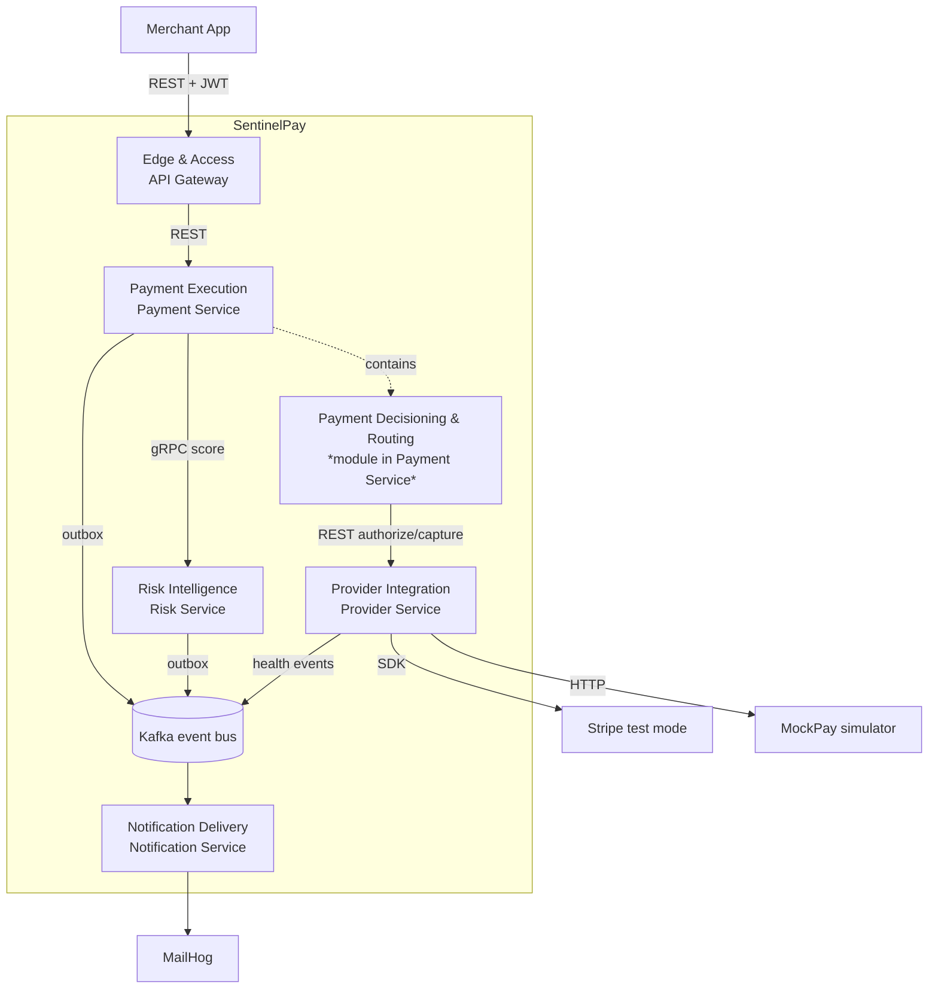
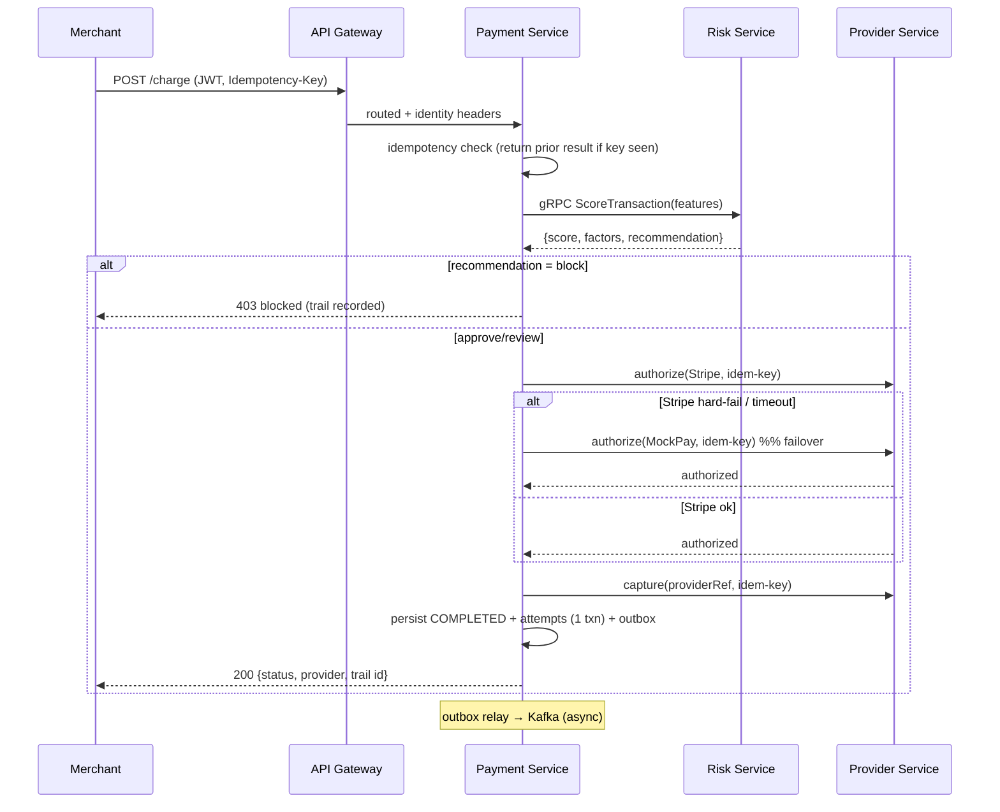

# System Design — SentinelPay (v1: Resilient Multi-Provider Routing & Failover)

> Scope is the v1 wedge defined in [PRD.md](../product/PRD.md): evaluate → decide → execute → explain, with idempotent cross-provider failover. The broader 10-service platform vision (`docs/product/vision/`) is the north-star target, not this build; where v1 diverges it is called out and backed by an ADR.

## Overview

SentinelPay v1 accepts a merchant charge, **evaluates** it through a pluggable risk pipeline, **decides** approve/review/block, **routes** it to a healthy payment provider with automatic in-request failover to a fallback provider, guarantees **no double-charge**, and records an **explainable decision trail** (risk factors + provider attempts + outcome). The primary user is the **Payment Operations Specialist**, who watches approval rates and provider health and can disable/re-prioritize a provider or toggle a risk rule without a deploy. The system optimizes for **reliability of the charge (recovered authorizations), exactly-once execution, and explainability**. It intentionally does **not** optimize for cost-based routing, ML scoring accuracy, multi-tenancy, or real-money/PCI operation — all sandbox-only and deferred per PRD non-goals.

## Architecture Style

**Chosen: event-driven microservices** — five deployable services with a **synchronous gRPC/REST critical path** and **asynchronous Kafka fan-out** for non-critical work.

**PRD justification.** The PRD names two constraints that override the usual default: (1) the project is a *portfolio demonstration of distributed-systems engineering*, and (2) it must *reuse the existing Spring Boot / Postgres-per-service / Redis / Kafka / gRPC stack*. Together these are explicit justification for distribution — see [ADR-0001](adrs/0001-event-driven-microservices-for-v1.md).

**Honest simplification note.** For a *real product* at v1 traffic, a **modular monolith** would be the correct choice — fewer moving parts, no network failure surface on the critical path, trivially exact idempotency. That alternative is documented and rejected *only because* the portfolio goal is to exercise service boundaries, gRPC, and event choreography. We contain the cost by keeping the correctness-critical logic (idempotency + failover) inside a single service rather than spreading it across a saga ([ADR-0004](adrs/0004-fold-decisioning-into-payment.md)).

**Key correction vs. existing docs.** The target-architecture docs model the payment decision as a Kafka choreography (`PaymentRequested → PaymentDecisionCreated`). That cannot return a single synchronous result for in-request failover, which the PRD requires. v1 therefore runs the decision path **synchronously** and reserves Kafka for after-the-fact fan-out — [ADR-0002](adrs/0002-synchronous-critical-path.md).

### Context / Bounded-context diagram

*Decisioning & Routing is a distinct bounded context but shares the Payment Service runtime in v1 (see Bounded Contexts and ADR-0004); the dashed "contains" edge reflects that.*

## Bounded Contexts

| Context | Responsibility | Owned Data | Dependencies | Upstream → Downstream |
|---|---|---|---|---|
| **Edge & Access** | Authenticate merchant (JWT), admit/reject requests, inject correlation ID, rate-limit | Rate-limit buckets (Redis) | Redis | Merchant App → Payment Execution |
| **Risk Intelligence** | Staged, pluggable risk-evaluation pipeline; produce explainable assessment (score + factors + recommendation). Evaluates, does not decide. | `risk_assessment`, velocity counters (Redis) | Redis | Payment Execution (gRPC) → Kafka |
| **Payment Decisioning & Routing** | Consume risk recommendation; gate approve/review/block; select provider by health + priority; drive failover strategy. *Decides, does not execute the network calls itself.* | Routing config, decision record (in payments DB) | Provider Integration, Risk | Payment Execution (in-process) → Provider Integration |
| **Payment Execution** | Payment lifecycle & state machine; idempotency; retry loop; system of record; publish lifecycle events | `payment`, `payment_attempt`, `idempotency_record`, `outbox` | Risk (gRPC), Provider (REST) | Edge → Provider, Kafka |
| **Provider Integration** | Provider abstraction (Stripe + MockPay adapters); authorize/capture; health monitoring | `provider_txn_ref`, provider health (Redis + DB) | Stripe, MockPay | Payment Execution → external providers, Kafka |
| **Notification Delivery** | Consume business events; deliver email notifications | `notification`, `delivery_attempt` | Kafka, MailHog | Kafka → MailHog |

Decisioning & Routing is listed as its own context (it is a cohesive responsibility and the seam where the future standalone Decision Service will split out) but is **realized inside the Payment Service runtime** in v1.

## Components

Each component notes the downstream architecture skill that will elaborate it.

### API Gateway (Edge & Access)
- **Responsibility:** Terminate merchant requests, validate JWT, inject `X-User-Id`/`X-Correlation-Id`, enforce token-bucket rate limits, route to Payment Service.
- **Interfaces:** Public REST (inbound); REST (outbound to Payment).
- **Dependencies:** Redis (rate-limit buckets).
- **I/O:** In: merchant HTTP + JWT. Out: authenticated request with identity headers.
- **Persistence:** None durable (Redis buckets only).
- **Consistency:** N/A (stateless).
- **Scaling:** Stateless, horizontal.
- **Implements:** `skills/architecture/backend-architecture`, `skills/architecture/security`.

### Risk Evaluation Pipeline (Risk Intelligence)
- **Responsibility:** 8-stage orchestrator — cache check → velocity read → feature assembly → **Strategy scorer** (rule-based v1) → cache write → velocity increment → persist assessment → emit event. Returns score + contributing factors + recommendation.
- **Interfaces:** gRPC `ScoreTransaction` (critical path); REST debug endpoint; internal Strategy interface `RiskScorer` (ONNX-ready seam).
- **Dependencies:** Redis (velocity, score cache); Postgres (assessments).
- **I/O:** In: transaction features. Out: `RiskAssessment{score, factors[], recommendation}`.
- **Persistence:** `risk_assessment` (Postgres); velocity + score cache (Redis, TTL).
- **Consistency:** Assessment write is strongly consistent; velocity counters are best-effort (degradation tolerated).
- **Scaling:** Stateless, horizontal; per-request p95 target well under the PRD's 150 ms budget.
- **Implements:** `skills/architecture/ai-native-engineering` (pluggable scorer seam), `skills/architecture/backend-architecture`.

### Payment Orchestrator (Payment Decisioning & Routing)
- **Responsibility:** The decision spine inside Payment Service — call Risk (gRPC), apply the approve/review/block gate, select provider (health + configured priority), and run the **failover loop** (attempt provider A; on hard-failure/timeout attempt provider B) under the idempotency guard.
- **Interfaces:** In-process API consumed by the charge handler; REST client to Provider Service.
- **Dependencies:** Risk (gRPC), Provider (REST), routing config.
- **I/O:** In: payment request + risk assessment. Out: ordered provider attempts + final decision.
- **Persistence:** Writes decision + each attempt to `payment_attempt`.
- **Consistency:** Strong within the Payment DB transaction boundary.
- **Scaling:** Scales with Payment Service.
- **Implements:** `skills/architecture/backend-architecture`, `skills/architecture/reliability`.

### Payment Ledger & Idempotency Store (Payment Execution)
- **Responsibility:** Own the `Payment` aggregate and state machine (Created→Authorized→Captured→Completed, plus Rejected/Failed/Refunded); enforce **exactly-once capture** via idempotency key; record status history.
- **Interfaces:** REST (`/payments`, `/payments/{id}`, refund, status).
- **Dependencies:** Postgres.
- **I/O:** In: charge/refund commands. Out: persisted payment + lifecycle events (via outbox).
- **Persistence:** `payment`, `payment_attempt`, `refund`, `idempotency_record`, `outbox` (Postgres).
- **Consistency:** Strong; idempotency + state transitions enforced in one DB transaction ([ADR-0005](adrs/0005-exactly-once-capture-idempotency.md)).
- **Scaling:** Stateless app tier; Postgres is the consistency anchor.
- **Implements:** `skills/architecture/backend-architecture`, `skills/architecture/data-architecture`.

### Provider Gateway & Adapters (Provider Integration)
- **Responsibility:** Uniform `PaymentProvider` interface with `StripeAdapter` (test mode) and `MockPayAdapter` (deterministic failure/latency injection); execute authorize/capture; normalize provider errors to a common taxonomy (hard-fail vs. retryable vs. ambiguous-timeout).
- **Interfaces:** REST (`/internal/providers/{provider}/authorize|capture`); Strategy interface `PaymentProvider`.
- **Dependencies:** Stripe SDK, MockPay HTTP.
- **I/O:** In: normalized authorize/capture command. Out: normalized provider result + provider txn ref.
- **Persistence:** `provider_txn_ref` (Postgres).
- **Consistency:** Provider call result is the external source of truth; ambiguous timeouts resolved by the caller's idempotency logic.
- **Scaling:** Stateless, horizontal.
- **Implements:** `skills/architecture/backend-architecture`.

### Provider Health Monitor (Provider Integration)
- **Responsibility:** Track rolling per-provider success rate, latency, and error class; expose health; emit `ProviderHealthChanged`/`ProviderUnavailable`; feed routing.
- **Interfaces:** REST (`/internal/providers/health`); Kafka producer.
- **Dependencies:** Redis (rolling windows).
- **I/O:** In: per-attempt outcomes. Out: health state + events.
- **Persistence:** Redis rolling counters (ephemeral); state snapshot in Postgres.
- **Consistency:** Best-effort/eventual; health is advisory.
- **Scaling:** Stateless, horizontal.
- **Implements:** `skills/architecture/backend-architecture`, `skills/architecture/reliability`.

### Transactional Outbox & Event Publisher (Payment / Risk / Provider)
- **Responsibility:** Persist domain events in the same DB transaction as the state change; a relay publishes to Kafka at-least-once with dedup keys.
- **Interfaces:** Internal write API; Kafka producer.
- **Dependencies:** Postgres (`outbox`), Kafka.
- **I/O:** In: domain event rows. Out: Kafka messages.
- **Persistence:** `outbox` per owning service.
- **Consistency:** At-least-once delivery; consumers must be idempotent ([ADR-0008](adrs/0008-transactional-outbox.md)).
- **Scaling:** Per-service relay.
- **Implements:** `skills/architecture/backend-architecture`.

### Notification Processor (Notification Delivery)
- **Responsibility:** Consume `PaymentCompleted`/`PaymentFailed`/`FraudAlertHigh`; render + deliver email; record delivery; idempotent per `eventId`.
- **Interfaces:** Kafka consumer; SMTP (MailHog).
- **Dependencies:** Kafka, MailHog, Postgres.
- **I/O:** In: business events. Out: emails + delivery records.
- **Persistence:** `notification`, `delivery_attempt` (Postgres).
- **Consistency:** Eventual; dedup by `eventId`.
- **Scaling:** Kafka consumer group, horizontal.
- **Implements:** `skills/architecture/backend-architecture`.

### Decision Trail Query (read surface across Payment + Risk)
- **Responsibility:** Serve the Payment Ops Specialist a per-transaction end-to-end trail — risk score + factors (from Risk) and provider attempts + outcome (from Payment).
- **Interfaces:** REST (`/payments/{id}/trail`, `/fraud/audit/{id}`).
- **Dependencies:** Payment DB, Risk DB (each via its owning service).
- **I/O:** In: transaction id. Out: composed trail.
- **Persistence:** None new — reads owning stores.
- **Consistency:** Read-time composition; each field sourced from its write owner.
- **Scaling:** Read-only, cacheable.
- **Implements:** `skills/architecture/backend-architecture`.

## Data Flow

**Entry point.** Merchant → API Gateway (`POST /api/v1/payments/charge`, JWT + idempotency key) → Payment Service.

**Synchronous critical path** (single request, one final result):

**Asynchronous fan-out.** Payment/Risk/Provider write events to their **outbox** in the same transaction as the state change; relays publish to Kafka. Notification consumes lifecycle + fraud-alert events. No consumer sits on the synchronous path.

**Source-of-truth / write ownership.**

| Entity | Write owner | Notes |
|---|---|---|
| `payment`, `payment_attempt`, `refund`, `idempotency_record` | Payment Service | System of record for execution |
| `risk_assessment` | Risk Service | Explainable assessment |
| `provider_txn_ref`, provider health | Provider Service | External-call references |
| `notification`, `delivery_attempt` | Notification Service | Delivery records |
| Velocity / score cache / rate-limit / health windows | Redis (owned by respective service) | Ephemeral, TTL'd |

**Idempotency & retries.** Every charge carries a merchant-supplied idempotency key; the same key returns the original outcome (PRD metric: double-charge = 0). Provider calls pass the key downstream so a retried authorize against the *same* provider does not double-authorize. **Ambiguous timeout** (no clear provider response) is treated as *unknown*, not *failed*: before failing over, the orchestrator reconciles via provider lookup/idempotent re-auth so it never captures twice ([ADR-0005](adrs/0005-exactly-once-capture-idempotency.md)). Kafka consumers dedup by `eventId`.

**Reconciliation.** v1 relies on synchronous reconciliation of ambiguous authorizations within the request; a lightweight scheduled sweep re-checks `payment_attempt` rows left in an indeterminate state. Full settlement reconciliation is out of scope (PRD non-goal).

## Persistence Strategy

Multiple stores, so documented explicitly.

- **PostgreSQL, database-per-service** (`payments`, `risk`, `provider`, `notifications`). Chosen for transactional integrity on the payment aggregate + idempotency, and to demonstrate ownership isolation ([ADR-0009](adrs/0009-database-per-service.md)). Cross-service references (e.g., `transactionId`) are logical only — no cross-DB FKs.
- **Redis** for ephemeral, high-churn, TTL'd data only: risk velocity counters + score cache, provider health rolling windows, gateway rate-limit buckets. Never the source of truth for money state.
- **Kafka** for durable event fan-out; topics keyed for ordering per aggregate (`merchantId`/`transactionId`).
- **Schema management:** Flyway migrations per service (the reference project used manual `schema.sql` for only 2/5 services; v1 standardizes on Flyway). **Retention:** decision trail / assessments retained for the demo horizon; no PII beyond test emails; deletion not required in sandbox.

## Failure Modes

| Component | Failure | User Impact | Detection | Recovery | Degradation |
|---|---|---|---|---|---|
| Risk Service (gRPC) | Unreachable/timeout on critical path | Charge would stall | gRPC deadline + circuit breaker in Payment | Amount-based **fallback scorer** (`fallback-v1.0.0`), `fallbackUsed=true` | Coarser risk decision, charge proceeds; flagged in trail |
| Provider A (Stripe) | Hard-fail / timeout on authorize | Would be a lost sale | Normalized error taxonomy + provider health | **Failover** to MockPay within the same request | Payment succeeds on fallback provider |
| Provider call | **Ambiguous timeout** (no clear response) | Risk of double-charge | No definitive result code | Reconcile via idempotent re-auth/lookup before failover | Never captures twice; may add latency |
| Idempotency store | Duplicate charge (same key, retry) | Double-charge risk | Unique idempotency key constraint | Return original outcome | Exactly-once preserved |
| Provider Health Monitor | Redis window unavailable | Routing lacks health signal | Redis ping / null reads | Default all providers "healthy," rely on live failover | Routing falls back to configured priority + reactive failover |
| Outbox relay | Kafka down | Notifications/trail-events delayed | Relay lag metric, unpublished outbox rows | Rows retried until Kafka recovers (at-least-once) | Core charge path unaffected; async events catch up |
| Notification consumer | Redelivery / crash mid-process | Duplicate email risk | Consumer offset + `eventId` | Idempotent dedup by `eventId` | At-most-one effective notification |
| API Gateway | Redis rate-limit store down | Requests unthrottled or blocked | Redis health | Fail-open on limiter (log), keep auth strict | Temporary loss of rate limiting only |

## Security and Compliance

- **AuthN:** Custom JWT (HS256) issued at login, validated at the API Gateway; identity propagated via `X-User-Id`/`X-Correlation-Id`. Downstream services trust gateway headers on the internal network (v1 boundary; mTLS deferred).
- **AuthZ:** Merchant-scoped access to own payments; internal endpoints (`/internal/**`) not exposed through the gateway.
- **Sensitive data:** v1 uses **provider test tokens** (Stripe test mode) — no raw PAN is handled or stored, keeping PCI scope out of v1 by design. Provider API keys are secrets (env/secret store), never persisted in app tables.
- **Tenant isolation:** single logical tenant in v1 (PRD non-goal); the merchant→payment scoping is the isolation seam the future multi-tenant model will extend. Explicitly **not** hardened for multi-tenant yet.
- **Auditability:** the decision trail (risk factors + provider attempts + outcome) is the v1 audit surface; a dedicated immutable Audit service is deferred.
- **Open compliance questions:** real-money PCI-DSS scope, webhook signature verification, and secret rotation are deferred to the venture path (PRD non-goals), not v1.

## Operational Considerations

- **Runtime:** single topology — Docker Compose locally (5 services + Postgres×4, Redis, Kafka, MailHog). Kubernetes/CI-CD are PRD non-goals for v1.
- **Observability:** Spring Actuator (`health`/`metrics`) per service; `X-Correlation-Id` threaded through the sync path and into event envelopes; per-attempt latency + decision recorded in the trail. RED metrics on the charge path support the PRD's latency and recovered-auth metrics.
- **Durable operational decisions worth noting:** the **transactional outbox** (adds a relay + `outbox` table per producer) and **Flyway migrations** are deliberate operational commitments — justified because reliable event delivery and reproducible schema are core to the showcase. The **MockPay** simulator is also an operational asset: it makes failover deterministically demonstrable (a load/chaos toggle), which the success metrics depend on.
- **Deploy/rollback:** per-service images; stateless app tiers roll independently; Postgres schema changes gated by Flyway. No feature-flag system in v1 (config toggles for provider priority / risk rules suffice).

## ADR Index

| ADR | Title | Status | Summary |
|---|---|---|---|
| [0001](adrs/0001-event-driven-microservices-for-v1.md) | Event-driven microservices for v1 (over modular monolith) | Accepted | Accept distributed complexity to satisfy the portfolio + stack-reuse constraints; note monolith is the "real product" answer. |
| [0002](adrs/0002-synchronous-critical-path.md) | Synchronous critical path, asynchronous fan-out | Accepted | Run risk/decision/routing/failover synchronously; reserve Kafka for after-the-fact events. Resolves the async-choreography conflict. |
| [0003](adrs/0003-grpc-for-risk-on-critical-path.md) | gRPC for Risk evaluation on the critical path | Accepted | Use gRPC (not REST) for Payment→Risk, mirroring the reference engine; typed contract, low latency. |
| [0004](adrs/0004-fold-decisioning-into-payment.md) | Fold decisioning, routing & failover into Payment Service | Accepted | Keep idempotency + failover in one process for v1 to protect double-charge=0; split out a Decision Service later. |
| [0005](adrs/0005-exactly-once-capture-idempotency.md) | Exactly-once capture via idempotency key + state machine | Accepted | Idempotency record + payment state machine + ambiguous-timeout reconciliation guarantee no double-charge across failover. |
| [0006](adrs/0006-provider-abstraction-mockpay.md) | Provider abstraction with a controllable simulated provider | Accepted | Common `PaymentProvider` interface; Stripe test mode + MockPay failure/latency injection for deterministic failover demos. |
| [0007](adrs/0007-pluggable-risk-scorer-strategy.md) | Pluggable risk scorer via Strategy interface | Accepted | Rule-based scorer behind a `RiskScorer` seam (ONNX-ready); v1 accepts imperfect scoring, real pipeline shape. |
| [0008](adrs/0008-transactional-outbox.md) | Transactional outbox for reliable event publication | Accepted | Persist events with state change; relay to Kafka at-least-once; consumers idempotent. |
| [0009](adrs/0009-database-per-service.md) | Database-per-service (Postgres) + Redis for ephemeral state | Accepted | Isolated Postgres per service for ownership; Redis only for TTL'd counters/health/cache. |
| [0010](adrs/0010-payment-optimistic-concurrency.md) | Optimistic concurrency + row locking for payment state | Accepted | `version` CAS + `SELECT FOR UPDATE` prevent lost updates across webhook/refund/sweep races. *(from data-architecture)* |
| [0011](adrs/0011-bounded-event-and-outbox-retention.md) | Bounded retention for outbox tables and Kafka topics | Accepted | Published-outbox purge + 7-day Kafka retention prevent unbounded event storage. *(from data-architecture)* |
